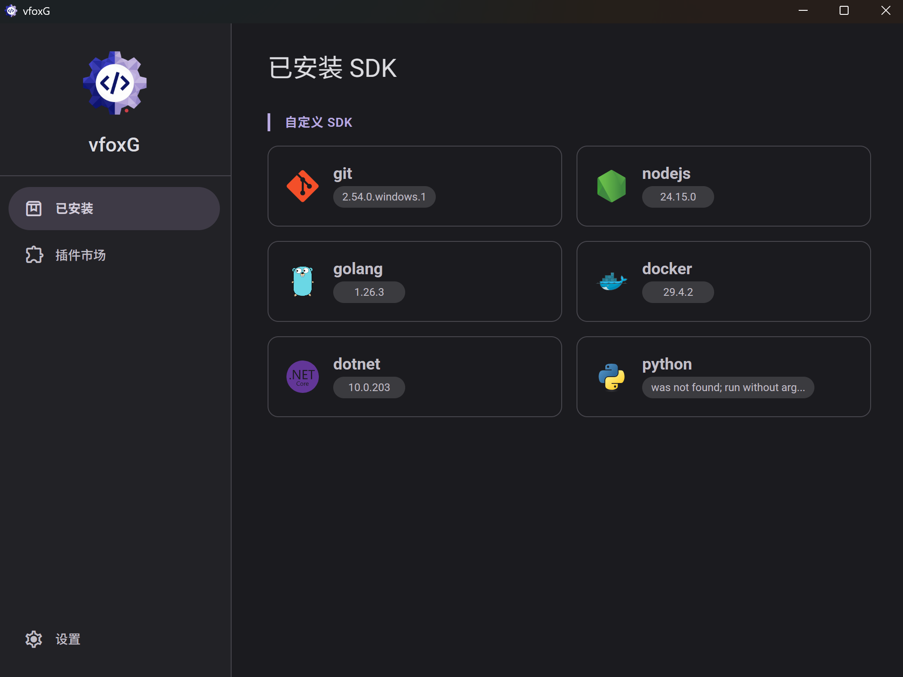

# vfoxG

<p align="center">
  
</p>

<p align="center">
  <strong>vfox GUI Manager &middot; Wails + Vue 3</strong><br>
  <strong>vfox 图形化管理界面</strong>
</p>

<p align="center">
  Manage vfox SDKs and custom system SDKs in one place. Switch versions with a single click.<br>
  统一管理 vfox SDK 和系统自定义 SDK，一键切换，告别命令行。
</p>

---

## Features / 功能特性

### SDK Management / SDK 管理
- **Version Management / 版本管理** — View, install, and uninstall vfox-managed SDK versions. / 查看、安装、卸载 vfox 管理的 SDK 版本。
- **One-Click Switch / 一键切换** — Switch global SDK version with a single click. No command line needed. / 点击应用即可全局切换 SDK 版本，无需手动输入命令。
- **Custom SDK / 自定义 SDK** — Bring system-installed SDKs (e.g. `C:\Python314`) under unified management. / 支持将系统已安装的 SDK 纳入统一管理。
- **Auto Scan / 自动扫描** — Automatically detect common SDKs installed on the system at startup. / 启动时自动检测系统中已安装的常见 SDK。

### Plugin Marketplace / 插件市场
- **Online Browse / 在线浏览** — Browse all available vfox plugins and add them with one click. / 查看所有可用的 vfox 插件，一键添加。
- **Version Search / 版本搜索** — Search for installable SDK versions remotely, with real-time progress. / 搜索远程可安装的 SDK 版本，带实时进度。

### System Integration / 系统集成
- **PATH Takeover / PATH 接管** — Resolve conflicts between Windows 11 App Aliases and SDKs. / 解决 Windows 11 应用别名（App Alias）与 SDK 冲突的问题。
- **Junction Architecture / Junction 架构** — All SDKs exposed via unified `~/.vfox/sdks/` symlinks. Switching versions never touches system PATH. / 通过统一的软链接管理所有 SDK，切换版本无需修改系统 PATH。
- **UAC Elevation / UAC 提权** — Auto-request admin privileges when system-level PATH changes are needed. / 需要修改系统级 PATH 时自动请求管理员权限。

### Others / 其他
- **Bilingual / 中英双语** — Supports Chinese and English UI, auto-follows system locale. / 支持中文和英文界面，自动跟随系统语言。
- **Modern UI / 现代 UI** — Material Design 3 style with animated transitions and frosted glass effects. / Material Design 3 风格，支持动画过渡和毛玻璃效果。

## Screenshots / 截图



## Architecture / 技术架构

```
+------------------------------------------+
|           Frontend (Vue 3)               |
|  SdkManager.vue | PluginMarket | Settings |
+------------------------------------------+
|        Wails v2 Bridge (RPC)             |
+------------------------------------------+
|           Backend (Go)                   |
|  app.go — SDK mgmt, version switch, PATH |
+------------------------------------------+
|         vfox CLI (core/)                 |
|  vfox.exe — underlying engine            |
+------------------------------------------+
```

**Core Design: Unified Junction Architecture / 核心设计：统一 Junction 架构**

Whether installed by vfox or added manually as a custom SDK, every SDK is exposed through a single Junction (symlink) at `~/.vfox/sdks/{name}`. Switching versions only updates the Junction target — the system PATH stays constant.

无论是 vfox 安装的 SDK 还是用户自定义的系统 SDK，都通过 `~/.vfox/sdks/{name}` 这个 Junction（软链接）统一对外暴露。切换版本时只需更新 Junction 指向，系统 PATH 始终不变。

## Prerequisites / 前置要求

| Tool / 工具 | Version / 版本 | Purpose / 用途 |
|-------------|---------------|----------------|
| [Go](https://go.dev/) | 1.21+ | Build backend / 编译后端 |
| [Node.js](https://nodejs.org/) | 18+ | Build frontend / 编译前端 |
| [Wails CLI](https://wails.io/docs/gettingstarted/installation) | v2 | Build framework / 构建框架 |
| [NSIS](https://nsis.sourceforge.io/) | 3.x | Package installer (optional) / 打包安装程序（可选） |

## Quick Start / 快速开始

### 1. Clone / 克隆

```bash
git clone https://github.com/HuajiFruit/vfoxG.git
cd vfoxG
```

### 2. Install vfox Core / 安装 vfox 核心

This project depends on the vfox CLI at runtime. Place it in the `core/` directory manually:

本项目运行时依赖 vfox 命令行工具，需要手动放置到 `core/` 目录：

```
vfoxG/
├── core/
│   └── vfox.exe    <- Download from https://github.com/version-fox/vfox/releases
├── app.go            # 从 https://github.com/version-fox/vfox/releases 下载
├── main.go
├── frontend/
└── ...
```

> The `core/` directory is excluded by `.gitignore` and will not be committed. / `core/` 目录已被 `.gitignore` 排除，不会被提交到仓库。

### 3. Dev Mode / 开发模式

```bash
# Install frontend dependencies / 安装前端依赖
cd frontend && npm install && cd ..

# Start dev mode (Go backend + Vite HMR) / 启动开发模式（Go 后端 + Vite 热重载）
wails dev
```

The app window opens automatically. Frontend changes hot-reload, Go changes trigger recompilation.

应用窗口会自动打开。修改前端代码会自动热重载，修改 Go 代码会自动重新编译。

### 4. Build / 构建

```bash
# Build a single portable executable / 构建单文件可执行程序
wails build -clean

# Build Windows NSIS installer / 构建 Windows NSIS 安装包
wails build -nsis -clean
```

Output goes to `build/bin/`. / 构建产物位于 `build/bin/` 目录。

## Project Structure / 项目结构

```
vfoxG/
├── app.go                  # Go backend core (SDK management, PATH ops)
├── main.go                 # Wails app entry point
├── app_test.go             # Unit tests / 单元测试
├── app_integration_test.go # Integration tests (needs vfox) / 集成测试
├── go.mod / go.sum         # Go dependencies / Go 依赖
├── wails.json              # Wails project config / Wails 项目配置
├── core/                   # vfox runtime (not versioned) / vfox 运行时
│   └── vfox.exe
├── frontend/               # Vue 3 frontend / Vue 3 前端
│   ├── src/
│   │   ├── App.vue         # Main layout (sidebar + router) / 主布局
│   │   ├── components/
│   │   │   ├── SdkManager.vue    # SDK management page / SDK 管理页面
│   │   │   ├── PluginMarket.vue  # Plugin marketplace / 插件市场
│   │   │   └── Settings.vue      # Settings page / 设置页面
│   │   ├── i18n.ts         # Internationalization (zh/en) / 国际化
│   │   └── style.css       # Global styles / 全局样式
│   └── index.html
└── build/
    └── windows/            # Windows build assets (icon, manifest)
```

## Key Implementation Details / 关键实现细节

### vfox Command Invocation / vfox 命令调用

All vfox commands go through `RunVfoxCommand`, which sets `__VFOX_SHELL=cmd` to prevent vfox from spawning an interactive shell that would deadlock the process.

所有 vfox 命令通过 `RunVfoxCommand` 统一调用，使用 `__VFOX_SHELL=cmd` 环境变量防止 vfox 弹出交互式 Shell 导致进程死锁。

### Version Switch Flow / 版本切换流程

1. User clicks "Apply" -> frontend optimistically updates UI / 用户点击应用 -> 前端乐观更新 UI
2. Backend asynchronously runs `vfox use --global name@version` / 后端异步执行
3. vfox updates `.vfox.toml` + creates Junction + writes registry / vfox 更新配置 + 创建 Junction + 写入注册表
4. Backend emits `sdk-list-changed` event / 后端发送事件
5. Frontend refreshes state / 前端刷新状态

### System PATH Takeover / 系统 PATH 接管

Windows 11 App Execution Aliases (e.g. `python.exe` -> Microsoft Store) can shadow vfox's PATH entries. The "Add to System PATH" feature uses admin privileges to prepend `~/.vfox/sdks/{name}` to the Machine PATH, ensuring vfox-managed versions always take priority.

Windows 11 的应用执行别名（如 `python.exe` -> Microsoft Store）会覆盖 vfox 的 PATH 设置。添加到系统 PATH 功能通过管理员权限将 `~/.vfox/sdks/{name}` 注入到 Machine PATH 最前面，确保 vfox 管理的版本永远优先。

---

## Third-Party Notices / 第三方声明

This project bundles [vfox](https://github.com/version-fox/vfox) (Apache License 2.0, Copyright Han Li and contributors) in unmodified binary form.

本项目以未修改的二进制形式包含 [vfox](https://github.com/version-fox/vfox)（Apache License 2.0，版权归 Han Li 及贡献者所有）。

vfoxG is an independent third-party GUI and is not affiliated with or endorsed by the vfox project.

vfoxG 是独立的第三方图形化界面，与 vfox 项目无关联，亦非其官方产品。
