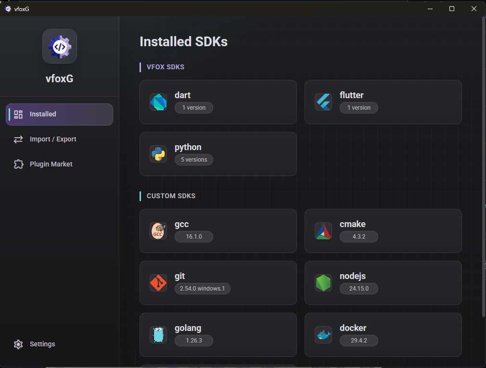

# vfoxG

[English README](README.md)

<p align="center">
  
</p>

<p align="center">
  <strong>vfox 图形化管理界面 · Wails + Vue 3</strong>
</p>

<p align="center">
  在桌面图形界面里统一管理 vfox SDK、插件、系统 SDK、PATH 集成和环境导入导出。
</p>

---

## 截图



## 下载

已发布版本可以在 [GitHub Releases](https://github.com/HuajiFruit/vfoxG/releases) 下载。

vfoxG 基于 Wails 构建。当前已验证的发布流水线会构建 Windows 安装包：

| 平台 | 产物 |
| --- | --- |
| Windows amd64 | `vfoxG-windows-amd64-installer.exe` |
| Windows 386 | `vfoxG-windows-386-installer.exe` |

其它桌面平台需要准备对应的 vfox core，并完成平台行为验证后再加入发布。

## 功能

- SDK 管理：查看、安装、卸载、切换和取消使用 vfox 管理的 SDK 版本。
- 自定义 SDK：添加系统里已有的 SDK，从可执行文件检测版本，并通过统一入口切换。
- 插件市场：浏览 vfox 插件、添加插件、移除插件，并在需要时保留自定义 SDK 路径。
- 发布版本感知搜索：没有 Release 的版本会显示为可重试状态，不会锁死 SDK 按钮。
- PATH 集成：添加或移除用户 PATH 中的 vfox，并在支持的平台管理 SDK 命令覆盖。
- Windows 兼容：处理应用执行别名冲突、junction、隐藏 PowerShell 辅助窗口和安装器清理。
- 下载目录迁移：用进度反馈和悬浮确认窗口迁移 vfox home/download 位置。
- 环境同步：导出当前 SDK 环境，并在另一台机器导入。
- 双语 UI 与文档：中文和英文资源保持并行维护。

## 文档

| 主题 | English | 中文 |
| --- | --- | --- |
| 文档索引 | [docs/README.md](docs/README.md) | [docs/README.zh-CN.md](docs/README.zh-CN.md) |
| 架构 | [docs/ARCHITECTURE.md](docs/ARCHITECTURE.md) | [docs/ARCHITECTURE.zh-CN.md](docs/ARCHITECTURE.zh-CN.md) |
| 开发 | [docs/DEVELOPMENT.md](docs/DEVELOPMENT.md) | [docs/DEVELOPMENT.zh-CN.md](docs/DEVELOPMENT.zh-CN.md) |
| 发布 | [docs/RELEASE.md](docs/RELEASE.md) | [docs/RELEASE.zh-CN.md](docs/RELEASE.zh-CN.md) |
| 代码规范 | [docs/CODE_STYLE.en.md](docs/CODE_STYLE.en.md) | [docs/CODE_STYLE.md](docs/CODE_STYLE.md) |
| 前端 | [frontend/README.md](frontend/README.md) | [frontend/README.zh-CN.md](frontend/README.zh-CN.md) |
| 构建资源 | [build/README.md](build/README.md) | [build/README.zh-CN.md](build/README.zh-CN.md) |

## 架构概览

```text
+------------------------------+
| Frontend: Vue 3 + TypeScript |
| components / composables     |
| services / i18n / styles     |
+--------------+---------------+
               |
               | Wails generated bindings
               v
+--------------+---------------+
| Backend: Go package main     |
| app_facade_* thin API layer  |
| sdk / plugin / sync / config |
| parser / path / platform     |
+--------------+---------------+
               |
               | command execution
               v
+--------------+---------------+
| vfox CLI core                |
| bundled in release builds    |
+------------------------------+
```

后端现在保持在 `package main` 内，但已经按原子职责拆分文件，避免影响 Wails 绑定稳定性。暴露给 Wails 的公开方法集中在 `app_facade_*.go`，业务逻辑拆到 `sdk_use.go`、`plugin_remove.go`、`migration_run.go`、`sync_import_apply.go` 等文件。

前端遵循组件、组合式函数、服务的依赖方向：

```text
components -> composables -> services -> frontend/wailsjs
```

组件负责渲染和用户事件，composable 负责页面状态和业务流程，service 是唯一直接导入 Wails 生成绑定的层。

## vfox Core

Release 构建会下载并内置 `.github/workflows/release.yml` 中声明的 Windows vfox core。

本地开发时，把对应平台的 vfox 可执行文件放到 `core/`：

```text
core/
  windows/
    x86_64/vfox.exe
    x86/vfox.exe
```

`core/` 已被 Git 忽略，本地二进制不会提交到仓库。

## 开发

环境要求：

| 工具 | 版本 |
| --- | --- |
| Go | 1.23+ |
| Node.js | 22+ |
| Wails CLI | v2 |
| NSIS | 3.x，仅 Windows 安装包需要 |

安装前端依赖：

```bash
npm --prefix frontend install
```

运行桌面应用：

```bash
wails dev
```

验证项目：

```bash
go test ./...
npm --prefix frontend run build
```

本地构建：

```bash
wails build -clean
```

构建 Windows amd64 安装包：

```bash
wails build -platform windows/amd64 -nsis -clean
```

## 项目结构

```text
vfoxG/
  app.go, app_lifecycle.go       App 状态和生命周期
  app_facade_*.go                Wails API facade 方法
  model_*.go                     与前端绑定共享的 DTO
  config_*.go                    app config、VFOX_HOME、下载目录
  vfox_*.go                      vfox 可执行文件、命令、环境、进度、任务锁
  parse_*.go                     vfox 输出纯解析器
  sdk_*.go                       SDK 列表、详情、安装、切换、自定义 SDK
  plugin_*.go                    插件市场、状态、添加、移除、缓存
  system_*.go                    系统 SDK 定义、扫描、缓存
  path_*.go                      PATH 比较和托管根目录 helper
  migration_*.go                 下载目录迁移和修复
  sync_*.go                      SDK 环境导入导出
  windows_*.go                   Windows PATH、shim、junction、提权逻辑
  unix_*.go                      Unix PATH 和 symlink 逻辑
  frontend/                      Vue 3 前端
  build/                         图标、manifest、安装脚本
  docs/                          中英双语项目文档
  .github/workflows/             发布流水线
```

## 发布流程

推送 `v*` tag 后会创建发布：

```bash
git tag -a v0.3.0 -m "v0.3.0"
git push origin v0.3.0
```

GitHub Actions 会下载 vfox core、构建 Windows 安装包，并上传 Release 产物。

## 致谢

感谢 [vfox](https://github.com/version-fox/vfox) 项目提供跨平台版本管理引擎，vfoxG 基于它构建图形化体验。

vfoxG 是独立的第三方图形界面，与 vfox 项目无官方关联，也非其官方产品。
